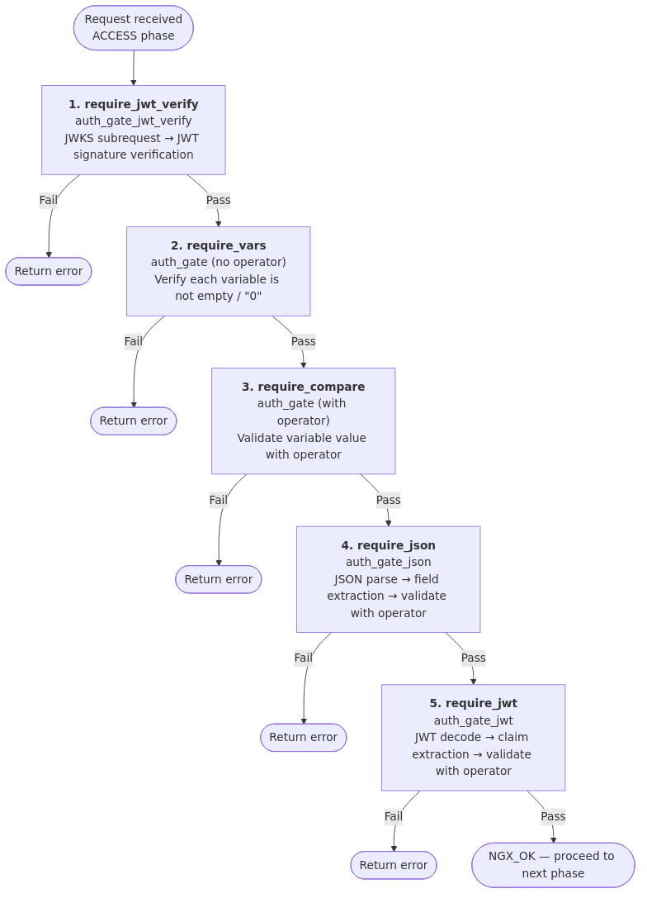

# nginx auth_gate Module

## Overview

### About This Module

The nginx auth_gate module is a dynamic module that adds variable value comparison validation, JSON field validation, JWT claim validation, and JWT signature verification capabilities to nginx. It operates in nginx's PRECONTENT phase, validating authorization conditions before requests reach the backend.

By combining it with other authentication modules (`oidc`, `auth_jwt`, etc.), you can achieve flexible access control.

**Example use cases**:
- Compare variable values using operators to verify specific conditions
- Validate specific roles or permissions from JSON such as OIDC claims
- Directly validate scopes or expiration times from JWT token payloads
- Verify JWT signatures using JWKS (JSON Web Key Sets)
- Combine the above conditions with AND for complex access control
- Variable truthiness checks (not empty, not `"0"`)

**Scope**: This module handles **authorization**. Authentication (user identity verification) is typically delegated to separate modules such as `auth_jwt` and `oidc`, but this module also provides built-in JWT signature verification via the `auth_gate_jwt_verify` directive.

**License**: MIT License

### Security

This module provides JWT signature verification via `auth_gate_jwt_verify` and handles authorization with various validation directives. See [SECURITY.md](docs/SECURITY.md) for security considerations.

### Relationship to the Commercial auth_require

The `auth_gate` directive also provides truthiness check functionality equivalent to the [`auth_require` directive from the nginx commercial subscription](https://nginx.org/en/docs/http/ngx_http_auth_require_module.html). See [COMMERCIAL_COMPATIBILITY.md](docs/COMMERCIAL_COMPATIBILITY.md) for details.

## Quick Start

See [INSTALL.md](docs/INSTALL.md) for installation instructions.

### Minimal Configuration

The following are minimal examples of each directive provided by the auth_gate module:

```nginx
load_module "/usr/lib/nginx/modules/ngx_http_auth_gate_module.so";

http {
    # Strip Bearer prefix from Authorization header
    map $http_authorization $bearer_token {
        default "";
        ~*^Bearer\s+(?<t>.+)$ $t;
    }

    server {
        # auth_gate: compare variable values with operators
        location /admin {
            auth_gate $arg_role eq "admin" error=403;
            proxy_pass http://backend;
        }

        # auth_gate_json: validate fields in a JSON variable
        location /api {
            auth_gate_json $json .role eq "admin" error=403;
            proxy_pass http://backend;
        }

        # auth_gate_jwt_verify: verify JWT signature using JWKS
        location = /jwks {
            internal;
            proxy_set_header Accept-Encoding "";
            proxy_pass http://idp/.well-known/jwks.json;
        }
        location /secure-api {
            auth_gate_jwt_verify $bearer_token jwks=/jwks;
            auth_gate_jwt $bearer_token .role eq "admin" error=403;
            proxy_pass http://backend;
        }

        # auth_gate_jwt: validate JWT token claims (assumes signature verification by another module)
        location /external {
            auth_gate_jwt $token .sub !eq "" error=401;
            proxy_pass http://backend;
        }
    }
}
```

## Directives

This module provides the following directives. See [DIRECTIVES.md](docs/DIRECTIVES.md) for details.

| Directive | Function |
|---|---|
| `auth_gate` | Operator-based variable value comparison, and variable truthiness check |
| `auth_gate_json` | Parse variable value as JSON and validate specified fields with operators |
| `auth_gate_jwt` | Decode variable value as JWT and validate payload claims (no signature verification) |
| `auth_gate_jwt_verify` | Verify JWT signature using JWKS fetched from an internal location |

There are 8 operators: `eq`, `gt`, `ge`, `lt`, `le`, `in`, `any`, and `match`, with negation possible via the `!` prefix.

## Embedded Variables

This module provides the following nginx variables. See [DIRECTIVES.md](docs/DIRECTIVES.md#embedded-variables) for details.

| Variable | Description |
|----------|-------------|
| `$auth_gate_epoch` | Current UNIX epoch time (seconds) |

## Appendix

### Processing Flow Overview

The auth_gate module operates in nginx's PRECONTENT phase. For each request, validations are executed in the following order. When any validation fails, short-circuit evaluation (skipping remaining checks) returns the corresponding `error` code (default: `401` for `auth_gate_jwt_verify`, `403` for others). The request proceeds to the next phase only if all validations pass.



### Standards References

- [nginx commercial auth_require](https://nginx.org/en/docs/http/ngx_http_auth_require_module.html): Commercial version directive specification
- [RFC 7519 - JSON Web Token (JWT)](https://tools.ietf.org/html/rfc7519): JWT specification
- [RFC 7515 - JSON Web Signature (JWS)](https://tools.ietf.org/html/rfc7515): JWS specification
- [RFC 7517 - JSON Web Key (JWK)](https://tools.ietf.org/html/rfc7517): JWK specification
- [jq Manual](https://stedolan.github.io/jq/manual/): Reference for field path syntax
- [PCRE - Perl Compatible Regular Expressions](https://www.pcre.org/): Regular expression engine for the `match` operator

## Related Documentation

**Configuration & Operations**:

- [DIRECTIVES.md](docs/DIRECTIVES.md): Directive and variable reference
- [EXAMPLES.md](docs/EXAMPLES.md): Quick start and practical configuration examples
- [INSTALL.md](docs/INSTALL.md): Installation guide (prerequisites, build instructions)
- [SECURITY.md](docs/SECURITY.md): Security considerations (JWT signature verification, input validation)
- [TROUBLESHOOTING.md](docs/TROUBLESHOOTING.md): Troubleshooting (common issues, log inspection)

**Reference**:

- [COMMERCIAL_COMPATIBILITY.md](docs/COMMERCIAL_COMPATIBILITY.md): Commercial auth_require compatibility
