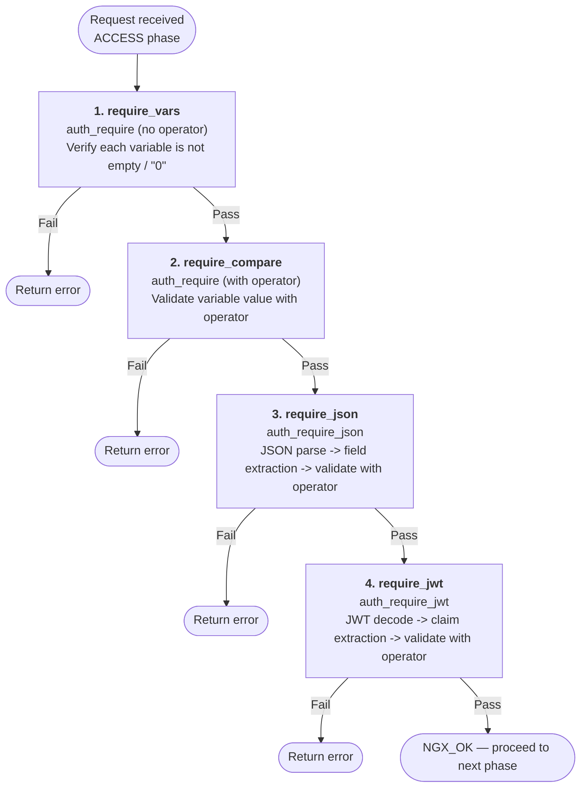

# nginx auth_require Module

## Overview

### About This Module

The nginx auth_require module is a dynamic module that adds variable truthiness checking and comparison validation capabilities to nginx. In addition to simple variable truthiness checks, it provides JSON field validation and JWT claim validation as extended features.

This module operates in nginx's ACCESS phase, validating authorization conditions before requests reach the backend. By combining it with other authentication modules (`auth_oidc`, `auth_jwt`, etc.), you can achieve flexible access control.

**Example use cases**:
- Check whether variables set by authentication modules are valid (i.e., user is logged in)
- Compare variable values using operators to verify specific conditions
- Validate specific roles or permissions from JSON such as OIDC claims
- Directly validate scopes or expiration times from JWT token payloads
- Combine the above conditions with AND for complex access control

**Scope**: This module handles **authorization**. Authentication (user identity verification and JWT signature verification) is delegated to separate modules such as `auth_jwt` and `auth_oidc` by design. Note that JWT signature verification is planned as a future feature addition.

### Security

This module handles authorization, with authentication delegated to separate modules by design. There are important considerations regarding JWT signature verification in particular. See [SECURITY.md](docs/SECURITY.md) for details.

### Relationship to the Commercial Version

This module is an OSS implementation of the [`auth_require` directive from the nginx commercial subscription](https://nginx.org/en/docs/http/ngx_http_auth_require_module.html). The truthiness check mode of the `auth_require` directive is fully compatible with the commercial version, and additionally provides operator comparison, JSON field validation, and JWT claim validation as proprietary extensions.

See [COMMERCIAL_COMPATIBILITY.md](docs/COMMERCIAL_COMPATIBILITY.md) for details.

**License**: MIT License

## Quick Start

See [INSTALL.md](docs/INSTALL.md) for installation instructions.

### Minimal Configuration (Commercial-Compatible)

The following is a minimal configuration example that demonstrates the auth_require module in action (equivalent to the [commercial version sample](https://nginx.org/en/docs/http/ngx_http_auth_require_module.html)):

```nginx
load_module "/usr/lib/nginx/modules/ngx_http_auth_require_module.so";

http {
    # Used in combination with authentication modules such as auth_oidc
    # oidc_provider my_idp { ... }

    map $oidc_claim_role $admin_role {
        "admin"  1;
    }

    server {
        # auth_oidc my_idp;

        location /admin {
            auth_require $admin_role;
            proxy_pass http://backend;
        }
    }
}
```

The basic pattern is to map claim values to variables using the `map` directive and perform truthiness checks with `auth_require`. `$admin_role` becomes `1` only when `role` is `"admin"`, and is empty (falsy) otherwise.

### Minimal Extension Examples

The following are minimal examples of each of this module's extension features:

```nginx
# auth_require comparison mode: compare variable values with operators
auth_require $arg_role eq "admin" error=403;

# auth_require_json: validate fields in a JSON variable
auth_require_json $oidc_claims .role eq "admin" error=403;

# auth_require_jwt: validate JWT token claims (assumes signature verification by another module)
auth_require_jwt $token .sub !eq "" error=401;
```

## Directives

This module provides the following directives. See [DIRECTIVES.md](docs/DIRECTIVES.md) for details.

| Directive | Function |
|---|---|
| `auth_require` | Variable truthiness check (commercial-compatible) + operator comparison mode |
| `auth_require_json` | Parse variable value as JSON and validate specified fields with operators |
| `auth_require_jwt` | Decode variable value as JWT and validate payload claims (no signature verification) |

There are 8 operators: `eq`, `gt`, `ge`, `lt`, `le`, `in`, `any`, and `match`, with negation possible via the `!` prefix.

## Embedded Variables

This module provides the following nginx variables. See [DIRECTIVES.md](docs/DIRECTIVES.md#embedded-variables) for details.

| Variable | Description |
|----------|-------------|
| `$auth_require_epoch` | Current UNIX epoch time (seconds) |

## Appendix

### Processing Flow Overview

The auth_require module operates in nginx's ACCESS phase. For each request, validations are executed in the following order. When any validation fails, short-circuit evaluation (skipping remaining checks) returns the corresponding `error` code (default: `403`). The request proceeds to the next phase only if all validations pass.



### Standards References

- [nginx commercial auth_require](https://nginx.org/en/docs/http/ngx_http_auth_require_module.html): Commercial version directive specification
- [RFC 7519 - JSON Web Token (JWT)](https://tools.ietf.org/html/rfc7519): JWT specification
- [RFC 7515 - JSON Web Signature (JWS)](https://tools.ietf.org/html/rfc7515): JWS specification
- [jq Manual](https://stedolan.github.io/jq/manual/): Reference for field path syntax
- [PCRE - Perl Compatible Regular Expressions](https://www.pcre.org/): Regular expression engine for the `match` operator

## Related Documentation

**Configuration & Operations**:

- [DIRECTIVES.md](docs/DIRECTIVES.md): Directive and variable reference
- [EXAMPLES.md](docs/EXAMPLES.md): Quick start and practical configuration examples
- [INSTALL.md](docs/INSTALL.md): Installation guide (prerequisites, build instructions)
- [SECURITY.md](docs/SECURITY.md): Security considerations (JWT signature verification, input validation)
- [TROUBLESHOOTING.md](docs/TROUBLESHOOTING.md): Troubleshooting (common issues, log inspection)

**Reference**:

- [COMMERCIAL_COMPATIBILITY.md](docs/COMMERCIAL_COMPATIBILITY.md): Commercial version compatibility

